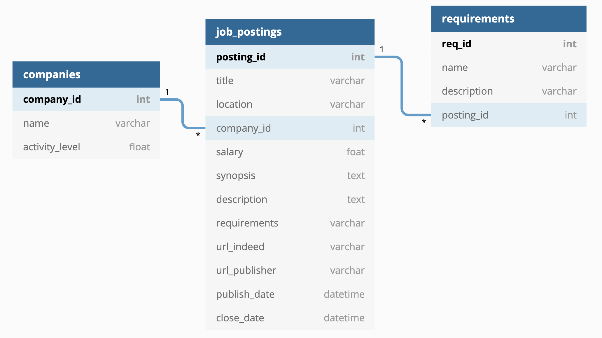

# Indeed_web_scraper

### Brief Description

- Training project to parse job postings from Indeed.com

### Installation

- See `requrements.txt` (currently the file contains too much information)

### Usage

- main_module.py will be executed as python script with arguments, but current version temporarily accepts no parameters.
- The output of main_module.py is the parsed information and stored in the local SQLite database `jobs.db`
  
  ​      

### Description

**Current project implementation**

- Currently, the project consists of 3 modules: `main_module.py`, `tools.py` and `db_manager.py`
    - #### main_module.py
        - Main logic of the program implemented and will be modified here. This module will be responsible for switching between operating modes of the program.
        
    - #### tools.py
        - The module contains parsing functions. Some other auxiliary functions will be added. 
        
    - #### db_manager.py
    
        - The module contains functions to create database and insert records to the existing database.
                

### Issues

- Slow execution
- User interface is under development

### TODOs

- requirements.md - keep those requirements that are really necessary
- exclude bare "except"
- add docstrings to classes and methods
- replace stubs to correct code
- make sure the program is working with large amount of parsed data

- Further potential steps:
- Specify operating modes of the program:
    - Parsing
    - User interaction over CLI
    - User interaction with the database via jupyter notebook
    - Monitoring
      - raise alarm on pre-defined evens, i. e.:
        - "a company started to hire more people than usual"
        - "a company decreased its activity on hiring people"
  - Elaborate database structure

# Database structure

Name of the database: `jobs.db`

Consists of 3 tables, the main table is `job_postings`

**Table `job_postings`**

Primary key: `posting_id`

Foreign key: `company_id`

**Table `companies`**

Primary key: `company_id`

**Table `requirements`**

Primary key: `req_id`

Foreign key: `job_postings`